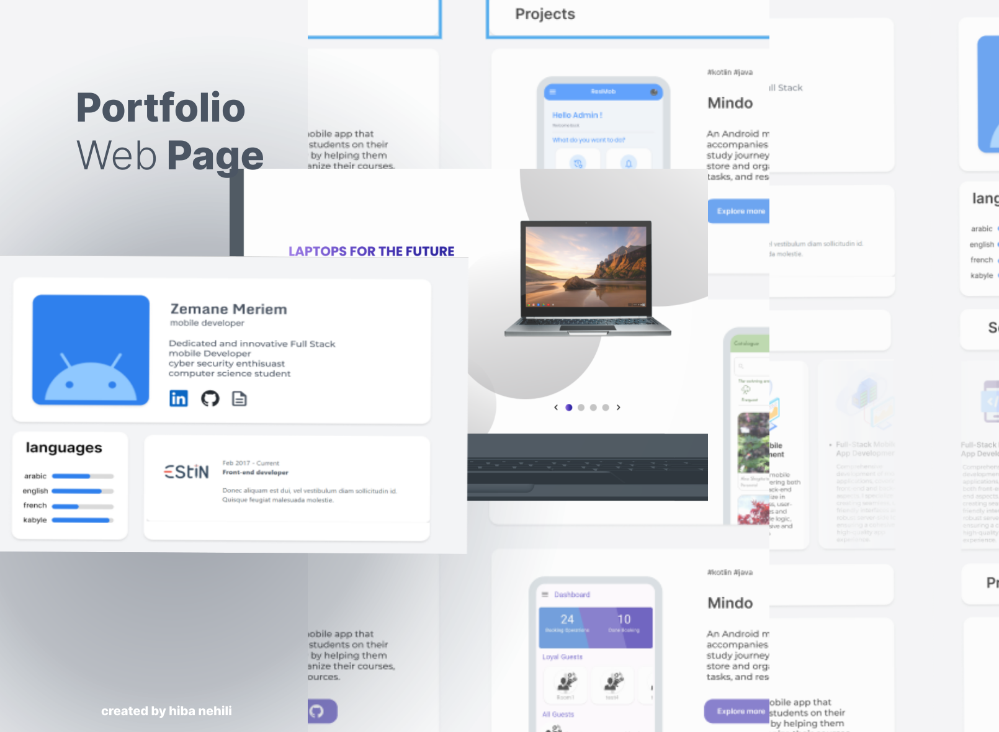

# Portfolio Website

This repository contains a responsive personal portfolio website template designed by me for a friend, using HTML, Tailwind CSS, and JavaScript. It showcases their skills, projects, and professional experience.

## Features

- Responsive design
- Personal info and contact details
- Languages and education sections
- Services and projects showcase

## Screenshots


## Usage

1. Clone the repository:
    ```bash
    git clone https://github.com/your-username/portfolio-website.git
    ```
2. Open `index.html` in your web browser.

## License

This project is licensed under the MIT License.
